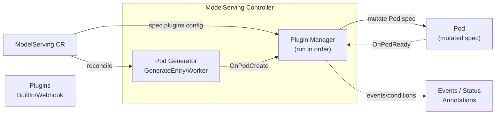

# ModelServing Plugin Framework

The ModelServing plugin framework lets you customize Pods created by the ModelServing controller through optional plugins. The framework supports different inference engines (e.g., vLLM, TensorRT-LLM) and different accelerators (GPU, NPU, etc.).

## Overview

The plugin framework provides an extensible way to customize Pods before creation without modifying the core ModelServing API. Key features include:

- **Opt-in**: When `plugins` is not configured, ModelServing behavior remains unchanged
- **Multi-plugin composition**: Support multiple plugins per ModelServing, executed in list order
- **Observability**: Track plugin execution status via Kubernetes Events and Status conditions

## Workflow



1. The controller generates the base Pod from the ModelServing `template`
2. If `spec.plugins` is configured, the Plugin Manager invokes each plugin's `OnPodCreate` hook in order
3. Plugins can modify Pod labels, annotations, env, volumes, nodeSelector, affinity, etc.
4. The mutated Pod is created in the cluster
5. When the Pod is ready, the `OnPodReady` hook is triggered (for logging, metrics, etc.)

## When to Use Plugins

ModelServing already allows users to set `role.entryTemplate.spec` / `role.workerTemplate.spec` directly. In practice, organizations often need additional cross-cutting customization that depends on:

- **runtime/inference engine specifics**: extra sidecars, init containers, env var conventions, ports, probes
- **accelerator type/vendor**: GPU vs NPU, driver injection, device plugin resources, runtimeClass
- **networking**: RDMA, topology constraints, hugepages
- **integration with cluster infrastructure**: custom schedulers, gang scheduling annotations, metadata conventions

For simple configuration, use `role.entryTemplate.spec` / `role.workerTemplate.spec` directly; for reusable logic across multiple ModelServing instances, use plugins.

## API Configuration

An optional `plugins` field is added to `ModelServingSpec`:

| Field | Type | Description |
|-------|------|-------------|
| `name` | string | Plugin identifier for logging and events |
| `type` | string | Plugin type, e.g., `BuiltIn`, `Webhook` (reserved for extension) |
| `config` | object | Plugin-specific configuration, parsed by each plugin |
| `scope` | string (optional) | Scope: entry, worker, or all |

### Example (illustrative)

The following is a complete ModelServing example with multiple plugins, demonstrating how to apply different built-in plugins for GPU and NPU inference scenarios:

```yaml
apiVersion: workload.kthena.io/v1alpha1
kind: ModelServing
metadata:
  name: llama-8b
spec:
  schedulerName: volcano
  replicas: 2
  plugins:
    - name: nvidia-gpu-defaults
      type: BuiltIn
      config:
        runtimeClassName: nvidia
        gpuResourceName: nvidia.com/gpu
        gpuCount: 1
    - name: huawei-ascend-defaults
      type: BuiltIn
      config:
        npuResourceName: huawei.com/Ascend910
        npuCount: 1
  template:
    roles: []
```

### Plugin Execution Order

- Plugins execute in the order defined in the `plugins` list
- Each plugin sees the Pod after previous plugins have applied their mutations
- If any plugin returns an error, Pod creation fails and the controller retries via workqueue

For more design details, see the [ModelServing Plugin Framework proposal](https://github.com/volcano-sh/kthena/blob/main/docs/proposal/modelserving-plugin-framework.md).
