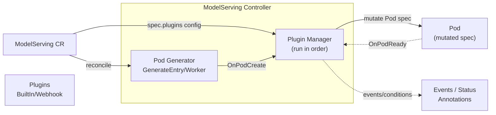

# ModelServing Plugin Framework

The ModelServing plugin framework lets you customize Pods created by the ModelServing controller through optional plugins. The framework supports different inference engines (e.g., vLLM, TensorRT-LLM) and different accelerators (GPU, NPU, etc.).

## Overview

The plugin framework provides an extensible way to customize Pods before creation without modifying the core ModelServing API. Key features include:

- **Opt-in**: When `plugins` is not configured, ModelServing behavior remains unchanged
- **Multi-plugin composition**: Support multiple plugins per ModelServing, executed in list order
- **Observability**: Track plugin execution status via Kubernetes Events and Status conditions

## Workflow



1. The controller generates the base Pod from the ModelServing `template`
2. If `spec.plugins` is configured, the Plugin Manager invokes each plugin's `OnPodCreate` hook in order
3. Plugins can modify Pod labels, annotations, env, volumes, nodeSelector, affinity, etc.
4. The mutated Pod is created in the cluster
5. When the Pod is ready, the `OnPodReady` hook is triggered (for logging, metrics, etc.)

## When to Use Plugins

ModelServing already allows users to set `role.entryTemplate.spec` / `role.workerTemplate.spec` directly. In practice, organizations often need additional cross-cutting customization that depends on:

- **runtime/inference engine specifics**: extra sidecars, init containers, env var conventions, ports, probes
- **accelerator type/vendor**: GPU vs NPU, driver injection, device plugin resources, runtimeClass
- **networking**: RDMA, topology constraints, hugepages
- **integration with cluster infrastructure**: custom schedulers, gang scheduling annotations, metadata conventions

For simple configuration, use `role.entryTemplate.spec` / `role.workerTemplate.spec` directly; for reusable logic across multiple ModelServing instances, use plugins.

## API Configuration

An optional `plugins` field is added to `ModelServingSpec`:

| Field | Type | Description |
|-------|------|-------------|
| `name` | string | Plugin type identifier; must match a registered plugin name (e.g., `demo-pod-tweaks`) |
| `type` | string | Plugin type, e.g., `BuiltIn` (Webhook reserved for future extension) |
| `config` | object | Plugin-specific configuration, parsed by each plugin |
| `scope` | object (optional) | Restricts where the plugin runs: `roles` (role names), `target` (Entry/Worker/All) |

### Developing a Custom Plugin

Built-in plugins live in `pkg/model-serving-controller/plugins/`. To add a custom plugin:

1. **Implement the Plugin interface** with `Name()`, `OnPodCreate()`, and `OnPodReady()`:

```go
type Plugin interface {
    Name() string
    OnPodCreate(ctx context.Context, req *HookRequest) error
    OnPodReady(ctx context.Context, req *HookRequest) error
}
```

2. **Define a config struct** for your plugin and decode it from `spec.Config` using `DecodeJSON()`:

```go
type MyConfig struct {
    RuntimeClassName string            `json:"runtimeClassName,omitempty"`
    Annotations      map[string]string `json:"annotations,omitempty"`
    Env              []corev1.EnvVar   `json:"env,omitempty"`
}
```

3. **Implement a factory function** that constructs the plugin from `PluginSpec`:

```go
func NewMyPlugin(spec workloadv1alpha1.PluginSpec) (Plugin, error) {
    cfg := MyConfig{}
    if err := DecodeJSON(spec.Config, &cfg); err != nil {
        return nil, err
    }
    return &MyPlugin{name: spec.Name, cfg: cfg}, nil
}
```

4. **Register the plugin** in `init()`:

```go
func init() {
    DefaultRegistry.Register("my-plugin-name", NewMyPlugin)
}
```

5. **Rebuild the controller** and deploy. The plugin will be available for use in ModelServing.

See `pkg/model-serving-controller/plugins/demo_plugin.go` for a reference implementation.

### Using Plugins

Kthena ships with a built-in demo plugin `demo-pod-tweaks` that can set `runtimeClassName`, add annotations, and inject environment variables. Use it to validate the plugin flow before developing your own.

**Example: Using the demo plugin**

```yaml
apiVersion: workload.kthena.io/v1alpha1
kind: ModelServing
metadata:
  name: llama-8b
spec:
  schedulerName: volcano
  replicas: 2
  plugins:
    - name: demo-pod-tweaks
      type: BuiltIn
      config:
        runtimeClassName: nvidia
        annotations:
          example.com/custom: "value"
        env:
          - name: CUSTOM_VAR
            value: "custom-value"
  template:
    roles: []
```

The `demo-pod-tweaks` plugin accepts:

| Config field | Type | Description |
|--------------|------|-------------|
| `runtimeClassName` | string | Sets `spec.runtimeClassName` on the Pod |
| `annotations` | map[string]string | Merges annotations into the Pod |
| `env` | []EnvVar | Appends environment variables to all containers |

**Example: Scoping a plugin to specific roles or targets**

```yaml
plugins:
  - name: demo-pod-tweaks
    type: BuiltIn
    scope:
      roles: ["worker"]
      target: Worker
    config:
      runtimeClassName: nvidia
```

### Plugin Execution Order

- Plugins execute in the order defined in the `plugins` list
- Each plugin sees the Pod after previous plugins have applied their mutations
- If any plugin returns an error, Pod creation fails and the controller retries via workqueue

For more design details, see the [ModelServing Plugin Framework proposal](https://github.com/volcano-sh/kthena/blob/main/docs/proposal/modelserving-plugin-framework.md).
